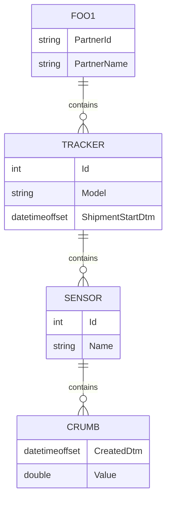
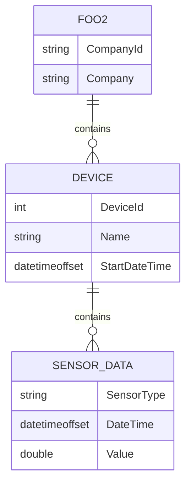
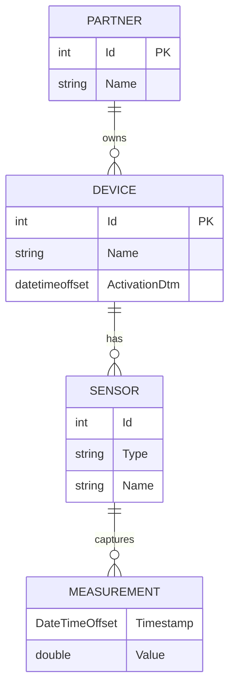

# Device Data Processing Take-Home

## Requirements

The task is to merge data from two JSON files containing data reported by IoT devices which capture
temperature and humidity data. Each device uses a slightly different JSON schema.

Files:

- [DeviceDataFoo1.json](samples/DeviceDataFoo1.json)
- [DeviceDataFoo2.json](samples/DeviceDataFoo2.json)

Develop a business layer solution using C# & .NET Core that will process data from each file, summarize the data
in to a single standardized list, and add some calculated values:

- Average temperature of each device
- Average humidity of each device
- Total record count for both temperature and humidity
- First and Last time each device reported sensor values

Save the merged list to a new JSON file.

Create tests which pass and cover the application logic appropriately.

The structure of the merged list should be defined as:

```csharp
public int CompanyId { get; set; } // Foo1: PartnerId, Foo2: CompanyId

public string CompanyName { get; set; } // Foo1: PartnerName, Foo2: Company

public int? DeviceId { get; set; } // Foo1: Id, Foo2: DeviceID

public string DeviceName { get; set; } // Foo1: Model, Foo2: Name

public DateTime? FirstReadingDtm { get; set; } // Foo1: Trackers.Sensors.Crumbs, Foo2: Devices.SensorData

public DateTime? LastReadingDtm { get; set; }

public int? TemperatureCount { get; set; }

public double? AverageTemperature { get; set; }

public int? HumidityCount { get; set; }

public double? AverageHumdity { get; set; }
```

## Delivery

Upload the solution to a cloud storage and share the link. (GitHub, Azure DevOps Repo, OneDrive, Google Drive,
Dropbox, etc.)

## Evaluation Criteria

- OO design
- Naming conventions
- Test cases
- Code organization/structure

## Data Model

### Ingestion models

<table>
<tr>
<td> Foo1 </td> <td> Foo2 </td>
</tr>
<tr>
<td>



</td>
<td>



</td>
</tr>
</table>

### Normalized domain model


